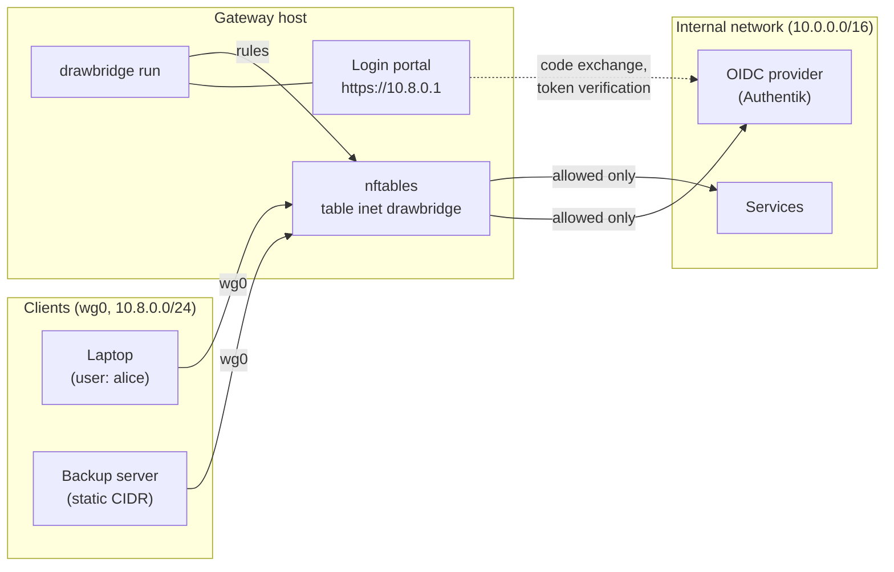
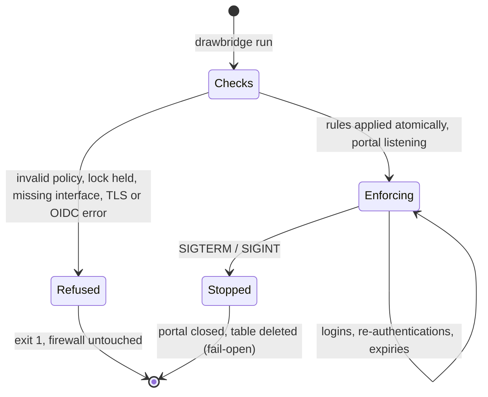
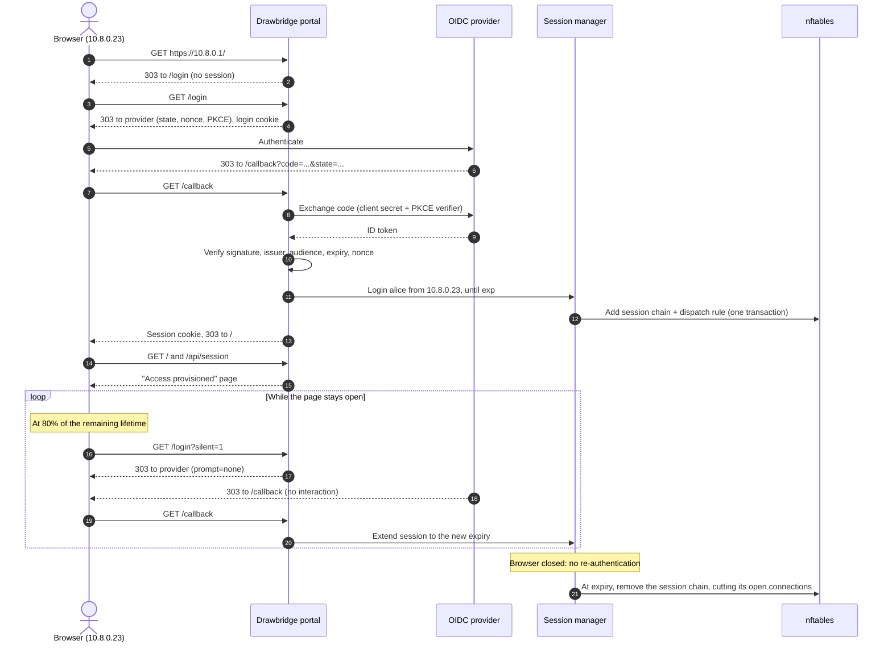
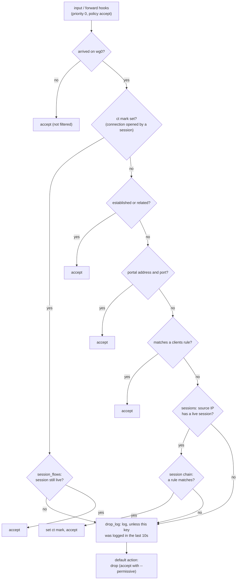

# Drawbridge

Drawbridge is an identity-aware access gateway for Linux, filtering at layers 3 and 4. It turns a
YAML allow-list policy into nftables rules for traffic arriving on a dedicated client interface,
such as a WireGuard `wg0`. That traffic gets through only in two ways:

- **Static access.** Machines are identified by source CIDR and are always allowed what the policy
  lists for them.
- **User access.** People log in through a small HTTPS portal on the gateway, using your OpenID
  Connect provider (e.g. Authentik). Their personal allow list is then applied to the IP address
  they logged in from, for as long as their login stays fresh.

Everything else arriving on that interface is dropped.



Behaviours to know up front:

- **Only the external interface is filtered.** Traffic arriving on any other interface (your admin
  network, the internal side) is untouched. The interface is assumed to carry only clients and to
  be statically addressed. Drawbridge makes no DHCP, ARP or IPv6 neighbour-discovery exceptions.
- **The policy is allow-only.** Nothing is reachable unless the policy says so, including the
  gateway host itself. The only built-in exception is the login portal.
- **Every change is atomic.** Rules are installed in a single nftables transaction. A rejected
  change leaves the previous rules in force.
- **Drops are logged.** Traffic that is dropped is logged to the kernel log, once per client,
  destination, protocol and port every 10 seconds.
- **Permissive mode for rollout.** With `--permissive`, traffic the policy doesn't allow is
  accepted and logged as "would-drop", so you can tune the policy on a live gateway before
  enforcing it.
- **Stopping is fail-open.** On a clean shutdown, Drawbridge deletes its table, and traffic on the
  external interface is no longer filtered. If you need fail-closed behaviour, add your own
  default-deny rules outside Drawbridge's table.
- **One instance at a time.** A lock file prevents two instances from fighting over the table.

## Contents

- [For users](#for-users)
- [For network administrators](#for-network-administrators)
  - [Deployment requirements](#deployment-requirements)
  - [Commands](#commands)
  - [Writing a policy](#writing-a-policy)
  - [Checking a policy](#checking-a-policy)
  - [Setting up the OIDC provider and TLS](#setting-up-the-oidc-provider-and-tls)
  - [Running as a service](#running-as-a-service)
  - [Rolling out with permissive mode](#rolling-out-with-permissive-mode)
  - [Configuration reference](#configuration-reference)
  - [Operating Drawbridge](#operating-drawbridge)
  - [Security notes](#security-notes)
- [How it works](#how-it-works)
  - [How a login works](#how-a-login-works)
  - [How the rules are laid out](#how-the-rules-are-laid-out)
- [Building and installing](#building-and-installing)

## For users

Your administrator will give you the portal address, e.g. `https://gateway.vpn.example.com`.

1. **Connect to the VPN** (or whatever network your administrator set up), then open the portal
   address in your browser.
2. **Log in.** You're taken straight to your organisation's login page. Once you've logged in, you
   come back to a page saying **"Access provisioned"**. It shows your account name, what you can
   now reach (e.g. `10.0.30.0/24 tcp/22`), and a countdown.
3. **Keep that tab open** while you work. It quietly renews your login before it runs out. You may
   see the page reload briefly when it does.

When you're finished, close the tab. Your access ends when the current login runs out (by default
within 15 minutes), and connections you still have open, such as SSH sessions, are cut at that
point too.

If something goes wrong:

| You see | What it means |
|---|---|
| **"No access"** after logging in | Your account has no access configured on this gateway. Ask your administrator. |
| **"Login expired"** or **"Login failed"** | The login took too long or couldn't be verified. Follow the link to try again. |
| The portal or login page doesn't load | Check that you're connected to the VPN. If you are, ask your administrator. |
| Access stops while the tab is open | Reload the portal page to log in again. |

Access belongs to your machine's address, not to your browser. Other programs on the same machine
use it too, and if someone else logs in from the same machine, their access replaces yours.

## For network administrators

This section covers deploying, configuring and operating a Drawbridge gateway. It assumes the
`drawbridge` binary is installed (see [Building and installing](#building-and-installing)).

### Deployment requirements

**Gateway host**

- Linux with nf_tables (any modern distribution kernel).
- A dedicated, statically addressed client interface, e.g. WireGuard `wg0`.
- IP forwarding enabled if clients reach networks behind the gateway
  (`net.ipv4.ip_forward=1`, `net.ipv6.conf.all.forwarding=1`).
- `CAP_NET_ADMIN` for Drawbridge. Add `CAP_NET_BIND_SERVICE` if the portal listens on a port
  below 1024.
- The kernel modules for the [dropped-traffic log](#dropped-traffic-log): `nft_log`,
  `nf_log_syslog` (`nf_log_ipv4` and `nf_log_ipv6` before Linux 5.12) and `nft_limit`. Distribution
  kernels load them on demand. On hosts that disable module loading, load them at boot, or `run`
  fails with "the kernel rejected the drop log".
- Optionally, the `nft` command-line tool, to inspect what Drawbridge installed.

**For user logins (the portal)**

- An OIDC provider reachable over **https**, from both the gateway and the clients' browsers.
- A TLS certificate and key for the portal, trusted by your users' browsers.

### Commands

Drawbridge has three subcommands:

| Command | Purpose |
|---|---|
| `drawbridge check` | Validate a policy and print the ruleset `run` would install. It needs no privileges and doesn't touch the kernel. |
| `drawbridge run` | Install the rules, serve the portal, and wait for SIGINT/SIGTERM; then remove the rules. |
| `drawbridge teardown` | Remove Drawbridge's nftables table, e.g. after a crash. A missing table counts as success. |

### Writing a policy

The policy is a single YAML file with two optional lists:
- `clients`: static access by source CIDR;
- `users`: per-user access after a portal login.

```yaml
# /etc/drawbridge/policy.yaml
clients:
  # Every WireGuard client may reach the identity provider and DNS, so that
  # users can log in. Without this, the login page can't load.
  - cidr: 10.8.0.0/24
    allow:
      - dest: [10.0.0.10/32]          # Authentik
        proto: tcp
        ports: [443]
      - dest: [10.0.0.53/32]          # internal DNS resolver
        proto: udp
        ports: [53]

  # A backup server, always allowed to the storage network.
  - cidr: 10.8.0.50/32
    allow:
      - dest: [10.0.20.0/24]
        proto: tcp
        ports: [22, 873, 9000-9100]
      - dest: [10.0.20.0/24]
        proto: icmp

  # IPv6 clients are listed separately; dests must match the client's family.
  - cidr: fd00:8::/64
    allow:
      - dest: ["fd00:20::/64"]
        proto: icmp

users:
  - username: alice
    allow:
      # A user's dests may mix IPv4 and IPv6; only those matching the
      # address alice logs in from are applied.
      - dest: [10.0.30.0/24, "fd00:30::/64"]
        proto: tcp
        ports: [22, 443]
      # The gateway host itself is reachable only if listed, like any other dest.
      - dest: [10.8.0.1/32]
        proto: tcp
        ports: [9100]

  - username: bob
    allow:
      - dest: [10.0.40.5/32]
        proto: any
```

Field rules:

| Field | Meaning |
|---|---|
| `clients[].cidr` | Source network, IPv4 or IPv6. Host bits are ignored (`10.8.0.7/24` means `10.8.0.0/24`). |
| `users[].username` | Matched **exactly and case-sensitively** against the configured username claim (see [below](#choosing-the-username-claim)). Must be unique. |
| `allow[].dest` | One or more destination CIDRs; must not be empty. For `clients`, every dest must be the same address family as `cidr`. |
| `allow[].proto` | `tcp`, `udp`, `icmp` (ICMP or ICMPv6 as appropriate) or `any`. |
| `allow[].ports` | Optional; `tcp`/`udp` only. Single ports (`443`) or inclusive ranges (`8000-8100`). Omitted means any port. |

Rules are additive and allow-only; there is no deny. Replies to allowed connections are always
permitted. Unknown fields are rejected, so typos fail loudly. Errors name the offending entry:

```text
$ drawbridge check --policy policy.yaml --external-iface wg0
2026-10-07T04:26:44.253051Z ERROR drawbridge: users[1].allow[0]: ports are only valid with tcp or udp, not icmp
```

> **Note:** a policy with `users` requires the portal to be enabled (`--portal-listen`), and
> `run` refuses to start otherwise.

### Checking a policy

`check` validates the policy and prints, in `nft` syntax, exactly the ruleset `run` would install
at startup. Run it after every policy change; it's safe to run anywhere. This is the bundled
[`examples/policy.yaml`](examples/policy.yaml):

```text
$ drawbridge check --policy examples/policy.yaml --external-iface wg0 --portal-listen 192.168.50.1:8443
table inet drawbridge {
	set drop_seen4 { type ipv4_addr . ipv4_addr . inet_proto . inet_service; size 65536; flags dynamic,timeout; timeout 10s; }
	set drop_seen4_proto { type ipv4_addr . ipv4_addr . inet_proto; size 65536; flags dynamic,timeout; timeout 10s; }
	set drop_seen6 { type ipv6_addr . ipv6_addr . inet_proto . inet_service; size 65536; flags dynamic,timeout; timeout 10s; }
	set drop_seen6_proto { type ipv6_addr . ipv6_addr . inet_proto; size 65536; flags dynamic,timeout; timeout 10s; }
	chain input {
		type filter hook input priority 0; policy accept;
		iifname "wg0" jump client_filter
		iifname "wg0" jump drop_log
		iifname "wg0" counter drop
	}
	chain forward {
		type filter hook forward priority 0; policy accept;
		iifname "wg0" jump client_filter
		iifname "wg0" jump drop_log
		iifname "wg0" counter drop
	}
	chain client_filter {
		ct mark != 0x00000000 goto session_flows
		ct state established,related accept
		ip daddr 192.168.50.1 tcp dport 8443 counter accept
		ip saddr 192.168.50.0/24 ip daddr 10.0.1.0/24 tcp dport 443 counter accept
		ip saddr 192.168.50.0/24 ip daddr 10.0.1.0/24 tcp dport 8000-8100 counter accept
		ip saddr 192.168.50.0/24 ip daddr 10.0.0.53/32 udp dport 53 counter accept
		ip6 saddr fd00:50::/64 ip6 daddr fd00:1::/64 meta l4proto ipv6-icmp counter accept
		jump sessions
	}
	chain session_flows {
	}
	chain sessions {
	}
	chain drop_log {
		meta l4proto tcp goto drop_log_ports
		meta l4proto udp goto drop_log_ports
		ip saddr . ip daddr . meta l4proto != @drop_seen4_proto add @drop_seen4_proto { ip saddr . ip daddr . meta l4proto } counter log prefix "drawbridge drop: "
		ip6 saddr . ip6 daddr . meta l4proto != @drop_seen6_proto add @drop_seen6_proto { ip6 saddr . ip6 daddr . meta l4proto } counter log prefix "drawbridge drop: "
	}
	chain drop_log_ports {
		ip saddr . ip daddr . meta l4proto . th dport != @drop_seen4 add @drop_seen4 { ip saddr . ip daddr . meta l4proto . th dport } counter log prefix "drawbridge drop: "
		ip6 saddr . ip6 daddr . meta l4proto . th dport != @drop_seen6 add @drop_seen6 { ip6 saddr . ip6 daddr . meta l4proto . th dport } counter log prefix "drawbridge drop: "
	}
}
```

User rules don't appear here. They're added per session, at login (see
[Inspecting the rules](#inspecting-the-rules)). The `set` definitions and the `drop_log` chains
implement the [dropped-traffic log](#dropped-traffic-log). With `--permissive`, the base chains end
in `counter accept` and the log prefix is `drawbridge would-drop: `.

### Setting up the OIDC provider and TLS

#### Register a client

In your provider, create a **confidential** OAuth2/OpenID Connect client (one that has a secret)
for a web application:

| Setting | Value |
|---|---|
| Grant type | Authorization code (Drawbridge always uses PKCE with S256) |
| Redirect URI | `<portal-url>/callback`, e.g. `https://gateway.vpn.example.com/callback` |
| Scopes | `openid` plus whatever `--oidc-scopes` asks for (`profile` by default; add `email` if you match on email) |
| Token endpoint authentication | Client secret (basic) |

**Authentik:** create an *OAuth2/OpenID Provider* with client type *Confidential*, add the
redirect URI above, and attach it to an *Application*. The issuer is
`https://<authentik-host>/application/o/<application-slug>/`. Authentik keeps an SSO session, so
background re-authentication happens without the user seeing anything.

Drawbridge refuses to start if the issuer, the token endpoint or the signing-key URL isn't
`https` (unless `--oidc-allow-insecure-http` is set). It also refuses if the provider can't be
reached at startup.

#### Choosing the username claim

The username claim decides **whose allow list a person gets**, so it must be a value users can't
change themselves.

| Claim | Notes |
|---|---|
| `preferred_username` (default) | Readable. Use it only if administrators, not users, control it at your provider (true of Authentik by default). |
| `email` | Accepted only when the provider marks it `email_verified: true`. Add `email` to `--oidc-scopes`. |
| `sub` | Guaranteed unique and stable, but often opaque (e.g. a UUID). |
| any other name | Read as a custom string claim, e.g. one your provider sets from a directory attribute. |

#### TLS certificate

Users' browsers must trust the portal certificate. Use a certificate from your internal CA or a
public CA, for a name that resolves to the gateway's client-side address. For a quick test, a
self-signed certificate works, but browsers will warn about it:

```sh
sudo openssl req -x509 -newkey ec -pkeyopt ec_paramgen_curve:prime256v1 -nodes -days 365 \
    -subj /CN=gateway.vpn.example.com \
    -addext subjectAltName=DNS:gateway.vpn.example.com,IP:10.8.0.1 \
    -keyout /etc/drawbridge/portal.key -out /etc/drawbridge/portal.crt
```

#### Make the provider reachable before login

Users' browsers have to reach the provider (and DNS) *before* they have any access. Allow both to
every client with a static `clients` rule, as in the [policy example](#writing-a-policy).
Drawbridge exempts only the portal itself automatically.

### Running as a service

An example environment file, readable only by root (`chmod 0600`):

```sh
# /etc/drawbridge/drawbridge.env
DRAWBRIDGE_POLICY=/etc/drawbridge/policy.yaml
DRAWBRIDGE_EXTERNAL_IFACE=wg0
DRAWBRIDGE_LOCK_FILE=/run/drawbridge/drawbridge.lock

DRAWBRIDGE_PORTAL_LISTEN=10.8.0.1:443
DRAWBRIDGE_PORTAL_URL=https://gateway.vpn.example.com
DRAWBRIDGE_TLS_CERT=/etc/drawbridge/portal.crt
DRAWBRIDGE_TLS_KEY=/etc/drawbridge/portal.key

DRAWBRIDGE_OIDC_ISSUER=https://auth.example.com/application/o/drawbridge/
DRAWBRIDGE_OIDC_CLIENT_ID=drawbridge
DRAWBRIDGE_OIDC_CLIENT_SECRET=change-me
DRAWBRIDGE_SESSION_MAX_TTL=15m
```

An example systemd unit. It runs as an unprivileged user with only the capabilities Drawbridge
needs:

```ini
# /etc/systemd/system/drawbridge.service
[Unit]
Description=Drawbridge access gateway
Wants=network-online.target
After=network-online.target wg-quick@wg0.service

[Service]
ExecStart=/usr/local/bin/drawbridge run
EnvironmentFile=/etc/drawbridge/drawbridge.env
User=drawbridge
Group=drawbridge
RuntimeDirectory=drawbridge
AmbientCapabilities=CAP_NET_ADMIN CAP_NET_BIND_SERVICE
CapabilityBoundingSet=CAP_NET_ADMIN CAP_NET_BIND_SERVICE
NoNewPrivileges=yes
ProtectSystem=strict
ProtectHome=yes
PrivateTmp=yes
RestrictAddressFamilies=AF_NETLINK AF_INET AF_INET6 AF_UNIX
# SIGTERM (the default) triggers a clean shutdown that removes the rules.
KillSignal=SIGTERM
Restart=on-failure

[Install]
WantedBy=multi-user.target
```

```sh
sudo useradd --system --no-create-home --shell /usr/sbin/nologin drawbridge
sudo chown root:drawbridge /etc/drawbridge/portal.key && sudo chmod 0640 /etc/drawbridge/portal.key
sudo systemctl daemon-reload
sudo systemctl enable --now drawbridge
journalctl -u drawbridge -f
```

#### Lifecycle



- **Startup:** the policy, lock, interface, TLS files, OIDC provider and listen sockets are all
  checked *before* the firewall is touched. Any problem exits with an error and changes nothing.
- **Applying** replaces any table left behind by an earlier run, in the same transaction.
- **Reloading the policy:** restart the service. The new rules apply atomically, but **user
  sessions are not kept across restarts.** Users lose access until they log in again. Reloading
  the portal page is enough when the provider still has their SSO session, and an open page also
  logs in again at its next scheduled renewal.
- **Shutdown** (SIGTERM/SIGINT) closes the portal, then deletes the table.
- **After a crash or `kill -9`**, the table stays in place, still enforcing the last rules. The
  next `run` replaces it, or remove it by hand:

  ```sh
  sudo drawbridge teardown --lock-file /run/drawbridge/drawbridge.lock
  ```

### Rolling out with permissive mode

To put Drawbridge on a gateway that already carries client traffic, without cutting anyone off
while you write the policy:

1. Write a first policy and check it with `drawbridge check`.
2. Start Drawbridge with `--permissive` (or `DRAWBRIDGE_PERMISSIVE=true`). Everything the policy
   allows works as normal, including portal logins and user sessions. Everything else is
   **accepted** and logged with the prefix `drawbridge would-drop: `. Drawbridge warns at startup
   that it isn't enforcing.
3. Watch the log (`journalctl -k -g 'drawbridge would-drop'`). Each line is traffic that enforcing
   mode would drop. Add policy entries for what clients need, and restart to apply them.
4. When nothing you need shows up any more, restart without `--permissive`.
5. Flush the connection-tracking table, e.g. `sudo conntrack -F` (from the `conntrack` package).
   Connections that permissive mode let through are otherwise still "established" and keep
   working after the switch, however the policy treats them. Flushing also makes every other
   tracked connection on the host be re-evaluated (and, for NAT, re-established), so do it at a
   quiet moment.

Permissive mode changes only the default action and the log prefix, so the log shows exactly what
enforcing mode would drop. Connections from an expired user session are also accepted and logged,
rather than cut.

### Configuration reference

Every option can be given as a flag or as an environment variable. Environment variables are the
recommended form for a service. Run `drawbridge run --help` for the authoritative list.

**Core**

| Flag | Environment variable | Default | Description |
|---|---|---|---|
| `--policy` | `DRAWBRIDGE_POLICY` | (required) | Path to the YAML policy. |
| `--external-iface` | `DRAWBRIDGE_EXTERNAL_IFACE` | (required) | Client interface, e.g. `wg0`: 1–15 characters from `A-Za-z0-9_.-`. It must exist when `run` starts. |
| `--lock-file` | `DRAWBRIDGE_LOCK_FILE` | `/run/drawbridge.lock` | Instance lock used by `run` and `teardown`. |
| `--permissive` | `DRAWBRIDGE_PERMISSIVE` | off | Accept traffic the policy doesn't allow, logging it as `drawbridge would-drop: ` instead of dropping it. For rollout; see [Rolling out with permissive mode](#rolling-out-with-permissive-mode). The variable takes `true` or `false`; anything else is a startup error. |
| | `RUST_LOG` | `info` | Log level/filter, e.g. `debug` or `drawbridge=debug`. |

**Portal** (setting `--portal-listen` enables the portal and makes the other portal and OIDC
options required)

| Flag | Environment variable | Default | Description |
|---|---|---|---|
| `--portal-listen` | `DRAWBRIDGE_PORTAL_LISTEN` | (off) | Comma-separated listen addresses, e.g. `10.8.0.1:443` or `10.8.0.1:443,[fd00:8::1]:443`. Each must be a specific gateway address, not `0.0.0.0`. Every client may connect to it. |
| `--portal-url` | `DRAWBRIDGE_PORTAL_URL` | | The `https://` URL users open, e.g. `https://gateway.vpn.example.com`. The OIDC redirect URI is this URL plus `/callback`. |
| `--tls-cert` | `DRAWBRIDGE_TLS_CERT` | | PEM certificate chain for the portal. |
| `--tls-key` | `DRAWBRIDGE_TLS_KEY` | | PEM private key for the portal. |

**OIDC**

| Flag | Environment variable | Default | Description |
|---|---|---|---|
| `--oidc-issuer` | `DRAWBRIDGE_OIDC_ISSUER` | | Issuer URL. Its discovery document is fetched at startup. |
| `--oidc-client-id` | `DRAWBRIDGE_OIDC_CLIENT_ID` | | Client ID registered with the provider. |
| `--oidc-client-secret` | `DRAWBRIDGE_OIDC_CLIENT_SECRET` | | Client secret. **Use the environment variable**, so the secret doesn't appear in the process list. |
| `--oidc-username-claim` | `DRAWBRIDGE_OIDC_USERNAME_CLAIM` | `preferred_username` | ID-token claim matched against `users[].username`. |
| `--oidc-scopes` | `DRAWBRIDGE_OIDC_SCOPES` | `profile` | Scopes to request besides `openid`, comma-separated, e.g. `profile,email`. |
| `--oidc-allow-insecure-http` | `DRAWBRIDGE_OIDC_ALLOW_INSECURE_HTTP` | off | Permit `http://` provider URLs. **For test setups only**: the secret and tokens then travel in cleartext. |

**Sessions**

| Flag | Environment variable | Default | Description |
|---|---|---|---|
| `--session-max-ttl` | `DRAWBRIDGE_SESSION_MAX_TTL` | `15m` | The longest one login or re-authentication keeps access, whatever the token's lifetime. Accepts `900`, `30s`, `15m` or `2h`; `0` means follow the token alone. |

A session lasts until the ID token expires, or until `--session-max-ttl` after the most recent
login, whichever comes first. The portal page re-authenticates in the background at 80% of the
remaining time. Once the page is closed, access, including open connections, ends at the next
expiry. Browsers slow down timers in background tabs, so keep the provider's ID-token lifetime and
`--session-max-ttl` at a few minutes or more; otherwise renewals can arrive late and access lapses
briefly.

### Operating Drawbridge

#### Inspecting the rules

```sh
sudo nft list table inet drawbridge            # everything
sudo nft list chain inet drawbridge sessions   # who is logged in, from where
```

With alice logged in from `10.8.0.23`, the session parts look like this:

```text
	chain session_flows {
		ip saddr 10.8.0.23 ct mark 0x5f3a91c2 accept
	}

	chain sessions {
		ip saddr 10.8.0.23 jump session_1597673922
	}

	chain session_1597673922 {
		ip saddr 10.8.0.23 ip daddr 10.0.30.0/24 tcp dport 22 ct mark set 0x5f3a91c2 counter accept
		ip saddr 10.8.0.23 ip daddr 10.0.30.0/24 tcp dport 443 ct mark set 0x5f3a91c2 counter accept
		ip saddr 10.8.0.23 ip daddr 10.8.0.1 tcp dport 9100 ct mark set 0x5f3a91c2 counter accept
	}
```

Each rule has a `counter`, so `nft list` also shows packets and bytes per rule. The counters on
the last rule of the `input` and `forward` chains show how much traffic is being denied (or, in
permissive mode, would be).

#### Dropped-traffic log

Every packet about to be dropped is logged to the kernel log, which journald and syslog collect,
with the prefix `drawbridge drop: ` (`drawbridge would-drop: ` in permissive mode):

```text
drawbridge drop: IN=wg0 OUT=eth1 SRC=10.8.0.23 DST=10.0.30.5 ... PROTO=TCP SPT=51234 DPT=3389 ...
```

`IN` and `OUT` tell forwarded traffic (`OUT` set) from traffic to the gateway itself. To keep the
log readable, each source, destination, protocol and destination port (TCP and UDP) is logged at
most once every 10 seconds; retries and repeated attempts within that window aren't logged again,
but are still dropped. Read it with `journalctl -k -g drawbridge`.

The recently logged keys are kept in the sets `drop_seen4`, `drop_seen4_proto`, `drop_seen6` and
`drop_seen6_proto` (65,536 entries each). `sudo nft list set inet drawbridge drop_seen4` shows
what was logged in the last 10 seconds.

To protect the journal from a scan, each of the four log rules writes at most 50 lines a second
(after a burst of 100). A new key held back by that limit, or because its set is full, isn't
logged then, but is counted by the rule after it (`... != @drop_seen4 counter`), and is logged on
a later packet once there's room. So if those counters in `drop_log` and `drop_log_ports` aren't
zero, the log is incomplete: someone, often a scanner, is generating more new keys than it shows.

> **Note:** the kernel doesn't log from inside containers (non-initial network namespaces) unless
> `net.netfilter.nf_log_all_netns=1` is set on the host. On a normal gateway host this doesn't
> apply.

#### Logs

Drawbridge logs to stderr (the journal under systemd). Set `RUST_LOG=debug` for more detail. Key
messages:

| Message | Meaning |
|---|---|
| `access provisioned` | Startup finished; the rules are in force. |
| `permissive mode: …` | Started with `--permissive`: traffic outside the policy is accepted, not dropped. |
| `portal listening` | The portal is accepting connections on the logged address. |
| `session provisioned` / `session extended` / `session replaced` | A user logged in, renewed, or a different user took over an IP. |
| `session expired` | A session reached its expiry and was removed. |
| `login refused: no policy for user` | The username isn't in the policy (the user saw "No access"). |
| `login verification failed` / `provider refused the login` | Token verification failed, or the provider returned an error. |
| `session update failed; rebuilding` | An incremental change failed; Drawbridge is rebuilding the whole table from its state. |
| `firewall rebuild failed; will retry` | The rebuild failed too; it retries every 5 seconds. Until it succeeds, the previous rules stay in force, possibly including an expired session. |
| `firewall resynchronised` | A retry succeeded. |
| `access deprovisioned` | Clean shutdown; the table was removed. |

#### Troubleshooting

| Symptom | Likely cause and fix |
|---|---|
| `external interface "wg0" not found` | The interface isn't up yet. Order the service after it (`After=wg-quick@wg0.service`). |
| `another drawbridge instance holds …` | Another instance is running, or `teardown` is in progress. Only one may manage the table. |
| `… is not https; set --oidc-allow-insecure-http …` | The issuer or one of its endpoints is plain http. Fix the provider URL; use the flag only for tests. |
| `contacting OIDC issuer …` | The gateway can't reach the provider, or the issuer URL is wrong. It must match the provider's `issuer` exactly, including any trailing slash. |
| `the policy has users, but the login portal is disabled` | Set `--portal-listen`, or remove `users`. |
| `portal listen address … must be a specific address` | Use the gateway's client-side address, not `0.0.0.0` or `[::]`. |
| The login page never loads | Clients can't reach the provider or DNS. Add a static `clients` rule for them. |
| "No access" after logging in | The username claim's value doesn't exactly match a `users[].username`. Check the claim name and case; log at `debug` to see the verified username. |
| Access ends while the page is open | The provider can't re-authenticate silently (it shows its login form instead), or the tab's timers were throttled. Check the provider's SSO session settings and token lifetimes. |

### Security notes

- **Fail-open by design.** Stopping Drawbridge removes all filtering on the external interface. If
  an outage must never open the network, add your own default-deny rules outside Drawbridge's
  table.
- **Permissive mode doesn't protect anything.** It accepts all traffic on the external interface
  that the policy doesn't, so use it only while rolling out, and check that production runs
  without `DRAWBRIDGE_PERMISSIVE`.
- **The portal is the only automatic exception.** Every client may connect to the listen
  addresses; everything else, including the provider and DNS, must be allowed in the policy.
- **Source IP is identity.** A session is bound to the TCP peer address the user logged in from.
  Don't put a reverse proxy or NAT in front of the portal, because every user would then share one
  address. On WireGuard, each peer's source addresses are fixed by its `AllowedIPs`, which stops
  peers from spoofing each other.
- **Sessions and cookies.** The browser holds only a random 256-bit session token. It's in a
  `__Host-` cookie marked HttpOnly, Secure and SameSite=Lax, valid only from the same source IP.
  Logins use state, nonce and PKCE, and the login cookie ties each callback to the browser and
  address that started it.
- **Protect the secrets.** Keep the client secret in an environment file readable only by root,
  and the TLS key readable only by the service.
- **Choose the username claim carefully.** See
  [Choosing the username claim](#choosing-the-username-claim).

## How it works

Implementation details, for anyone who wants to know what Drawbridge does on the wire and in the
kernel.

### How a login works



### How the rules are laid out

Drawbridge owns a single table, `inet drawbridge`, which handles IPv4 and IPv6. Packets arriving
on the external interface take this path:



- Every session gets its own chain, `session_<id>`. Logins, extensions and expiries each change
  the firewall in one transaction.
- Connections a session opens are tagged with the session's id as their conntrack mark. When the
  session ends, `session_flows` no longer accepts their packets, and they meet the default action,
  so access really stops, not just for new connections.
- There is exactly one default action, the last rule of each base chain. Everything not accepted
  along the way returns to it, after `drop_log`.
- **Drawbridge owns the conntrack mark** on connections arriving on the external interface. Don't
  run other tools that set conntrack marks on that traffic.
- Session ids start at a random value on each run, so connections marked before a restart can't
  pass as a new session's.

## Building and installing

### Build requirements

- Rust 1.89 or newer.
- libclang (`libclang-dev` on Debian/Ubuntu), used by the nftables bindings at build time.

Drawbridge links [rustables](https://crates.io/crates/rustables), which is licensed
GPL-3.0-or-later, so distributed binaries are subject to its terms (see [License](#license)).

### Installing

```sh
sudo apt-get install -y build-essential libclang-dev    # Debian/Ubuntu build dependencies
cargo build --release
sudo install -m 0755 target/release/drawbridge /usr/local/bin/drawbridge
drawbridge --version
```

### Development

```sh
cargo build
cargo test                            # unit tests, no privileges needed
cargo clippy --all-targets
./e2e/run.sh                          # full end-to-end test in Docker (no root needed)
```

The end-to-end test starts a Docker Compose stack:
- a gateway, a server and three clients on a stand-in for WireGuard;
- [Dex](https://dexidp.io/) as the OIDC provider.

It checks static allow and deny paths over IPv4 and IPv6, and portal logins: refused users, IP
binding, re-authentication, and expiry cutting a live connection. Finally, it checks that
everything opens up again after shutdown.

The kernel integration tests need `CAP_NET_ADMIN`. Run them in a throwaway network namespace, or
in the e2e image:

```sh
cargo test --no-run && sudo unshare -n cargo test --test kernel -- --ignored
```

Never run `drawbridge run` or `teardown` on a development machine; they change its firewall. See
[`AGENTS.md`](AGENTS.md) for the design invariants and code layout, and [`docs/`](docs/) for the
specifications.

## License

The Drawbridge source is licensed under either of

- Apache License, Version 2.0 ([LICENSE-APACHE](LICENSE-APACHE) or
  <http://www.apache.org/licenses/LICENSE-2.0>)
- MIT license ([LICENSE-MIT](LICENSE-MIT) or <http://opensource.org/licenses/MIT>)

at your option.

Built binaries statically link [rustables](https://crates.io/crates/rustables), which is licensed
GPL-3.0-or-later. A distributed `drawbridge` binary is therefore subject, as a whole, to the terms
of GPL-3.0-or-later, including the obligation to provide its corresponding source.

Unless you explicitly state otherwise, any contribution intentionally submitted for inclusion in
the work by you, as defined in the Apache-2.0 license, shall be dual licensed as above, without any
additional terms or conditions.
