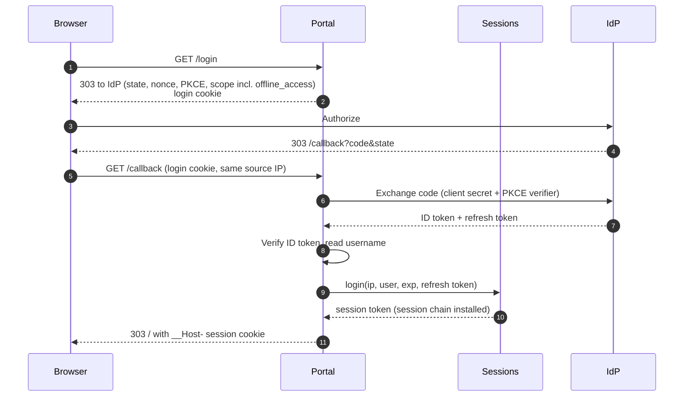
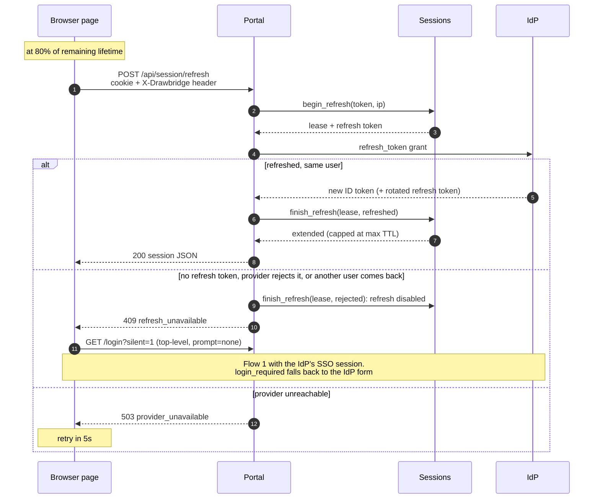
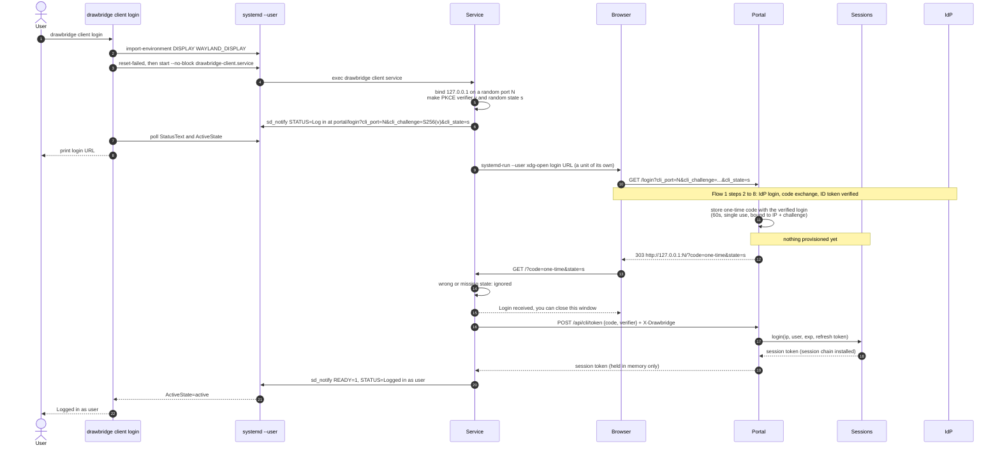
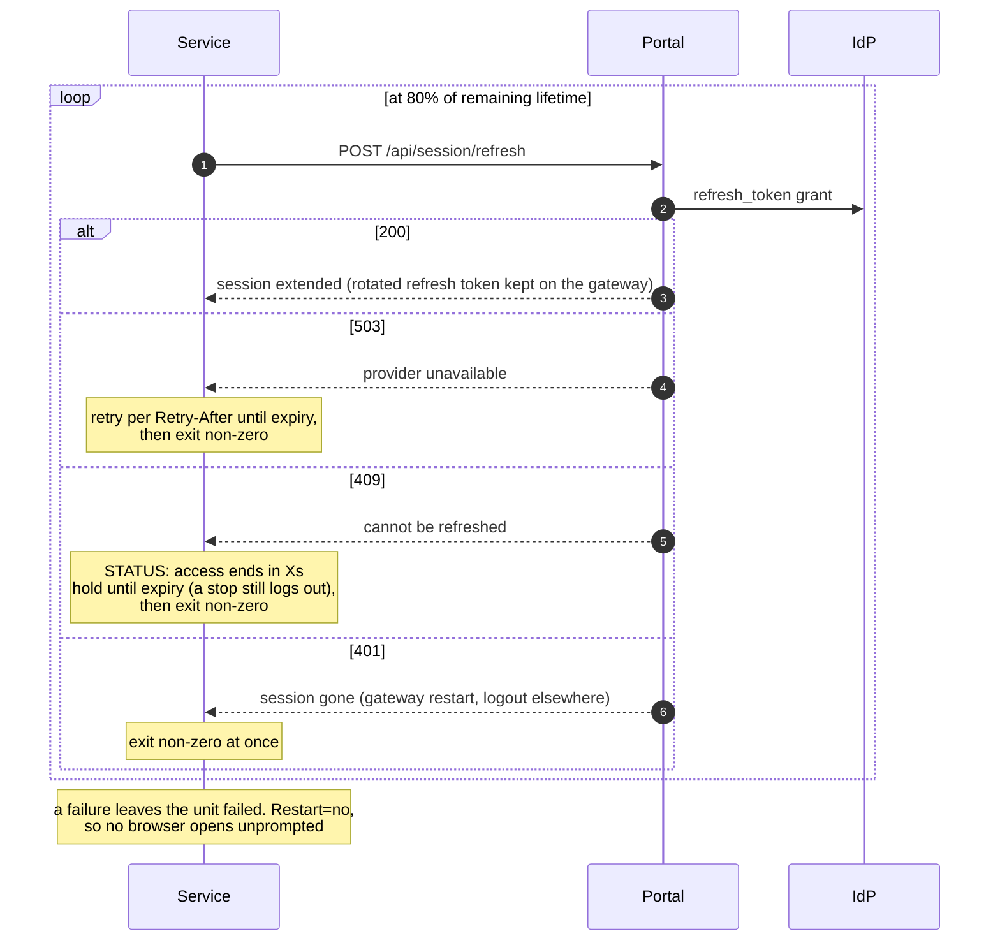
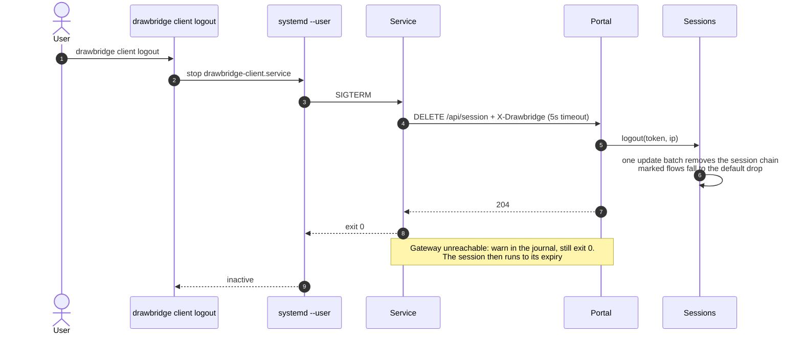

# 0002: CLI and user systemd service to log in and maintain a session

- Issue: https://github.com/ChrisPortman/Drawbridge/issues/5 (#5)
- Status: Accepted
- Date: 2026-10-11

## Context

Users get access by logging in to the portal in a browser. The portal is a confidential OIDC client
(secret + PKCE); the browser holds only the `__Host-` session cookie. A session lasts until the ID
token's `exp`, capped at `--session-max-ttl` from each login. The page keeps it alive by a
top-level redirect to `/login?silent=1` (`prompt=none`) at 80% of the remaining lifetime, which
works only because the provider's SSO cookie is in the browser (decision 0001).

The issue asks for `drawbridge client login` / `logout` / `init`, in the same binary as the gateway,
with a user systemd service that keeps the session alive, and for the existing commands to move
under `drawbridge server`. A background service has no browser and no provider SSO cookie, so it
cannot extend a session the way the page does. The design had to give it another way that still
keeps the session bounded by the provider.

## Scope

In scope:
- `drawbridge server run|check|teardown` and `drawbridge client init|login|logout`, plus a hidden
  `client service` that the unit runs.
- Gateway-held refresh tokens; `POST /api/session/refresh`, used by both the browser page and the
  service; the browser falls back to `prompt=none` when a session has no usable refresh token.
- A loopback + one-time-code handoff (`POST /api/cli/token`) and `DELETE /api/session`.
- A `Type=notify` user unit whose process owns login, refresh and logout.
- e2e coverage with a stub `systemctl`; README, AGENTS.md and this record.

Out of scope: non-Linux and non-systemd systems; group-based access; a logout button in the
browser; revoking refresh tokens at the provider; hidden stubs for the old top-level commands; Dex
telemetry.

Assumptions made without asking:
- The `--oidc-scopes` default becomes `profile,offline_access`.
- A refresh must return the same username, and the max-TTL cap applies from each refresh, as it does
  from each re-login.
- A rotated refresh token replaces the stored one; only one refresh per session is in flight.
- The client reads `client.yaml` (written by `init`) and trusts the OS store plus `--ca-cert`.
- The service waits 9m30s for a login, inside `TimeoutStartSec=10min` (the portal's login window is
  10 minutes).
- `client login` runs `systemctl --user reset-failed` before starting the unit, so a failure left
  by an earlier run isn't mistaken for this one.

## Definition of done

- [ ] Unit tests: SessionTable refresh (extend, rotation, max-TTL cap, username mismatch, lease
      races, logout); portal endpoints (refresh 401/409/503 and IP checks, CLI token single-use /
      verifier / TTL / IP, `DELETE /api/session`, CLI login parameter validation); the unit file,
      `sd_notify`, unit-state parsing and `login` polling, API status mapping, the loopback
      listener; parsing of the `server` / `client` command tree.
- [ ] e2e with the stub `systemctl`: `init` writes the unit; `client login` blocks, prints the URL
      and returns once access is open; the service extends by refresh past the first expiry
      (gateway `session extended via=refresh`, no provisioned/expired/ended line, Dex logs no
      login), twice so the rotated token is shown to work; `client logout` cuts access and the open
      connection at once (gateway `session ended`); starting and stopping with the stub's
      `systemctl` directly behaves the same; a browser page refresh extends; without refresh tokens
      the gateway answers 409, the page's `prompt=none` fallback extends, and the service fails
      with the unit left failed; the CLI output is printed as evidence.
- [ ] README, AGENTS.md, this record, and `server run` in the `.claude` skills and agents.
- [ ] `cargo fmt`, `cargo clippy --all-targets` (warning-free), `cargo test` and `./e2e/run.sh`
      pass. No nftables changes, so no golden files and no kernel test changes.

## Decisions

**How the service extends a session.** Options: the gateway keeps a refresh token and the client
asks it to refresh; a heartbeat that extends without the provider; the CLI as its own public OIDC
client holding a refresh token on disk. The user asked whether both clients should move to a public
client. That was weighed against keeping the confidential client: a public client puts tokens in
browser JS, makes ID tokens bearer credentials that need a gateway-issued nonce bound to the IP,
leaves refresh tokens on user disks, reverses two invariants and rewrites the portal. Chosen:
**confidential client, and both the browser and the service extend through a gateway-held refresh
token** (`POST /api/session/refresh`). The heartbeat was rejected because it breaks the invariant
that a session lasts until the ID token's `exp`. Trade-offs accepted: the provider must issue
refresh tokens to the portal (`offline_access`), the gateway holds them in memory, and the browser's
behaviour changes beyond what the issue asked.

**No usable refresh token.** Options: the browser falls back to today's `prompt=none`; refresh only.
Chosen: **the browser falls back** on a 409, so providers that issue no refresh tokens keep working
in browsers and decision 0001's checks stay as the fallback's tests. The service can't fall back;
it exits.

**Token handoff to the CLI.** Options: loopback redirect with a one-time code exchanged with a PKCE
verifier; the token itself in the loopback URL. Chosen: **one-time code**. The token never appears
in a URL or browser history, a stolen code is useless without the verifier, and the portal only
redirects to `127.0.0.1` with a validated port.

**Logout.** Options: stop the service and end the session at the gateway now; stop only, as the
issue words it. Chosen: **end it now** through `DELETE /api/session`, which goes through the normal
update batch and so also cuts the session's connections.

**Who runs the login.** Planned first as: `client login` runs the browser flow, stores the token in
`$XDG_RUNTIME_DIR` and starts the service. The user changed this: **`login` and `logout` only start
and stop the unit, and the unit's process runs the login and the logout**, so plain
`systemctl --user start` / `stop` give the same experience. The token then lives only in the
service's memory and no token file exists; SIGTERM (stop, or machine shutdown) ends the session.

**Reporting the login in the terminal.** Options: `Type=notify`, so start blocks until access is
live; `Type=simple` with the URL only in the journal. Chosen: **`Type=notify`**. The process sends
`STATUS=Log in at <url>` and `READY=1`; `client login` polls the unit's status and prints it. The
same success or failure shows whether the user ran the CLI or systemctl. `sd_notify` is a small
datagram sender, with no new crate.

**A lost session** (gateway restart, refresh refused). Options: exit with failure; start a new
login. Chosen: **exit with failure**, with `Restart=no`, so no browser windows open unprompted.

**`--no-browser`.** Planned on `login`; the planner moved it to `init` (`open_browser` in
`client.yaml`). A per-login environment variable would make a manual `systemctl start` behave
differently, and could stay set in the user manager if `login` were killed. The user accepted the
move.

**`client login` when the unit is already active.** Options: report and exit 0; restart and log in
again. Chosen: **report and exit 0**, as `systemctl start` does on an active unit. To switch users,
log out first.

**Command restructure.** Options: hard break; hidden aliases. Chosen: **hard break**, as the issue
asks and the crate is 0.1.0. Hidden error stubs for the old commands were also offered and
declined: clap's error and the README upgrade note are enough.

**e2e without systemd.** Options: a stub `systemctl` that runs the unit's `ExecStart`; a
systemd-booted container; running the service directly. Chosen: **the stub**, selected through
`DRAWBRIDGE_SYSTEMCTL`, modelling notify readiness so `client login`'s real polling runs. It does
not prove systemd accepts the unit; a unit test checks the file and the README describes
`systemd-analyze --user verify`.

**Provider-side evidence of a refresh.** It is unverified whether Dex 2.46 logs a refresh grant.
Options: check Dex's log and fall back to its metrics; gateway-side evidence only. Chosen:
**gateway-side only**: `session extended via=refresh`, and Dex logging neither `login successful`
nor `re-authenticated from session` in the window.

**Client TLS roots.** Options: the OS store plus `--ca-cert`; the bundled Mozilla roots plus
`--ca-cert`. Chosen: **the OS store plus `--ca-cert`**, so CAs installed on the machine work. The
gateway's OIDC client turns native roots off to keep today's trust.

**Turning certificate checks off** (asked for after the PR was opened). The user asked for an
option that disables validation of the portal's and the IdP's certificates, and for the e2e to
use it to drop its test CA. The client service only connects to the portal (the browser talks to
the IdP, the gateway exchanges codes with it), so it covers the portal:
`--insecure-skip-tls-verify` / `DRAWBRIDGE_INSECURE_SKIP_TLS_VERIFY` on `client init` (saved in
`client.yaml`) and on the service, which warns at startup when it is on. The URL must still be
https, and a flag can only turn the checks off, never back on over the file (re-running `init`
without it does). `client login` shows "(portal certificate checks off)", and `init` refuses
`--ca-cert` together with it. The trade-off accepted is a footgun for production use; the help
and README mark it as for test setups only, and `--ca-cert` stays the way to trust an internal
CA. The e2e no longer exercises the verified path; a unit test does instead, against a local TLS
server with a self-signed test certificate (`tests/data/portal-test.crt`): refused by default,
accepted through `--ca-cert`, and accepted with checks off.

**Optional e2e checks.** The user chose both: a second refresh (rotation works) and the lost-session
path.

## Implementation summary

- `Cargo.toml`: direct `reqwest` (native roots, json); tokio `net`.
- `portal/oidc.rs`: `complete` returns the refresh token; `Authenticator::refresh`; Rejected and
  Unreachable failures.
- `session.rs`: refresh token and lease per session; `begin_refresh` / `finish_refresh` / `logout`;
  `session extended` logged with `via`.
- `portal/api.rs` (wire types), `portal.rs` (refresh, delete and CLI token routes; CLI login
  parameters and loopback redirect; a generic bounded store), `portal/index.html` (refresh with
  fallback).
- `cli.rs`, `main.rs`: the `server` / `client` trees. `cli/client.rs` with `unit.rs`, `notify.rs`,
  `api.rs`, `loopback.rs`.
- e2e: a `user` account, `e2e/systemctl-stub`, `offline_access` in the gateway's scopes, `server
  run`, new CLI and no-refresh-token sections in `run.sh`.
- README, AGENTS.md, `.claude` skills and agents.

### Flows

The flows as built. *Portal* is the gateway's HTTPS portal, *Sessions* the session table and
nftables, *IdP* the OIDC provider, *Service* the process drawbridge-client.service runs.

**1. Browser login.** As before, now also requesting `offline_access`; the gateway keeps the
refresh token with the session, in memory.

**2. The browser keeps the session alive.** At 80% of the remaining lifetime the page refreshes
through the gateway; only a session without a usable refresh token falls back to `prompt=none`.

**3. Command-line login through the user service.** `drawbridge client login` only starts the
unit, so `systemctl --user start drawbridge-client` behaves the same. The unit is `Type=notify`:
the start returns once access is live.

**4. The service keeps the session alive.** The browser page's refresh endpoint, with the
session token as the cookie. A session it can't refresh is held until it expires, so a stop still
ends it at the gateway.

**5. Logout.** `drawbridge client logout` only stops the unit, so `systemctl --user stop` and
machine shutdown take the same path. The session ends at once, and the connections it opened are
cut through their conntrack mark.

## Deviations

Found during implementation:
- **PKCE verifier length.** `PkceCodeChallenge::from_code_verifier_sha256` panics outside 43–128
  characters, so `POST /api/cli/token` validates the verifier first (`s256`); a unit test found it.
- **e2e certificate.** The image's self-signed portal certificate was a CA certificate, which
  rustls refuses as a server's own (`CaUsedAsEndEntity`); curl never noticed with `-k`. The image
  first built a test CA and a server certificate from it, for the CLI's `--ca-cert`. After the PR
  was opened, the user asked for an option that turns the client's certificate checks off and for
  the e2e to use it instead: the image is back to its single self-signed certificate, and the
  e2e's `client init` uses `--insecure-skip-tls-verify` (see Decisions).
- **e2e plumbing.** The stub `systemctl` must detach what it backgrounds from its caller's output
  (dash keeps copies of redirected descriptors in function calls), or `client login`, which reads
  systemctl's output, waits forever. A gateway restarted with `dc exec -d` logs to the exec, so
  the no-refresh-token restart sends its output to PID 1's for `log_has`.
- **Status text** shows the time left ("expires in 29s") rather than a local clock time: there is
  no time-zone support in the dependency tree.
- **Logs go to stderr** (`with_writer(std::io::stderr)`), without colour codes unless stderr is a
  terminal. `tracing_subscriber` wrote to stdout before, though the README said stderr; this
  keeps the client commands' output on stdout apart from their logs.
- **The settings file path** is fixed for `init`; `--config` is for the service only.

From the reviews:
- **Typed wire codes.** API error codes and the loopback's `error=` are enums in `portal/api.rs`
  (`ErrorCode`, `LoginError`) instead of strings on each side.
- **A refresh can't revive an expired session** that the expiry timer hasn't removed yet;
  `finish_refresh` checks the expiry as `begin_refresh` does.
- **Provisioned at redemption.** A CLI session is provisioned when the one-time code is redeemed,
  not at `/callback`, so a login nobody redeems (interrupted, or opened elsewhere) leaves nothing
  open. Whether the user has access is therefore reported then (403 `no_access`), and the loopback
  only learns of provider failures (`LoginError::LoginFailed`).
- **Loopback state.** The service adds a random `cli_state` that the portal echoes to the
  loopback; its listener ignores callbacks without it, so another local process can't abort or
  stall a login. The user chose this plus documentation over a confirmation page or forcing
  `prompt=login` against crafted login links on shared machines: those attacks need a
  co-resident user, who already shares the machine's access.
- **A session that can't be refreshed (409) is held until it expires** instead of the service
  exiting at once, so `client logout` still ends it at the gateway; the service then fails. This
  keeps "exit with failure", later.
- **Unit hardening.** `LimitCORE=0`, `NoNewPrivileges`, `LockPersonality` and
  `RestrictAddressFamilies`. The browser is started with `systemd-run --user` as a unit of its
  own, outside that sandbox (and outside the service, so stopping it doesn't close the browser),
  and without `NOTIFY_SOCKET`. Checked on a real user manager with a transient unit and
  `systemd-analyze --user verify`; READY → active is covered by the stub only.
- **Smaller fixes:** the client clamps a nonsensical `expires_at`; the token-holding types lose
  or redact `Debug`; timeouts derive from the portal's `LOGIN_TTL`; `client login` is
  synchronous.
- **Module cycle accepted.** `session` uses `portal::Secret` for the refresh token while
  `portal` uses `session`. Moving `Secret` would mean a new top-level module, against the layout
  of `docs/04-specification.refactor1.md`.
- **Not done:** the per-/64 IPv6 limit on pending logins, now also applied to CLI codes, groups
  every IPv6 client of a shared /64 together (pre-existing; a follow-up). Matching `sub` as well
  as the username on refresh was left out; the username check suffices for access.

## Consequences

Browsers no longer depend on the provider's SSO session for extension when refresh tokens are
issued. Operators should set the provider's idle and absolute refresh-token lifetimes, which now
bound how long one login can last. Sessions can last as long as the provider keeps honouring the refresh token while a page or
the service is running, bounded per refresh by the max TTL. Upgrades must change `ExecStart` to
`drawbridge server run`; a unit left on `drawbridge run` fails open. Refresh tokens are dropped, not
revoked at the provider, when a session ends (a possible follow-up, RFC 7009). The stub `systemctl`
means real systemd notify and timeout behaviour is only checked by hand.
